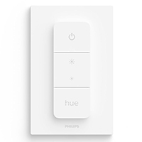

# Home Assistant Blueprints

A collection of blueprints for Home Assistant.

## Available Blueprints

### IKEA Remotes

- [IKEA RODRET Two Button Remote](./switch-ikea-rodret-two-button-remote.yaml)
  - Compatible with IKEA RODRET dimmer/power switch (E2201)
  - Supports short press, double press, long press and release after long press for both buttons
  - Optional battery level warning actions
  
  
  
  

- [IKEA SOMRIG Two Button Remote](./switch-ikea-somrig-two-button-remote.yaml)
  - Compatible with IKEA SOMRIG shortcut button (E2213)
  - Supports short press, double press, long press and release after long press for both buttons
  - Optional battery level warning actions
  
  
  
  

- [IKEA STYRBAR Four Button Remote](./switch-ikea-styrbar-four-button-remote.yaml)
  - Compatible with IKEA STYRBAR remote (E2001/E2002)
  - Supports short press and long press for all four buttons
  - Optional battery level warning actions
  
  
  
  

### Philips Remotes

- [Philips Hue Dimmer Switch](./switch-hue-dimmer-switch.yaml)
  - Compatible with Philips Hue Dimmer Switch RWL020 (US) and RWL021 (EU)
  - Supports short press, long press, and double press for all buttons
  - Configurable actions for all four buttons
  
  
  
  

### IKEA Sensors

- [IKEA PARASOLL Door/Window Sensor](./switch-ikea-parasoll-door-window-sensor.yaml)
  - Compatible with IKEA PARASOLL door/window sensor (E2013)
  - Triggers actions on opening and closing events
  - Optional battery level warning actions
  
  
  
  

- [IKEA VALLHORN Motion Sensor](./switch-ikea-vallhorn-motion-sensor.yaml)
  - Compatible with IKEA VALLHORN motion sensor (E2134)
  - Triggers actions on motion detection
  - Configurable no-motion delay
  - Optional battery level warning actions
  
  
  
  

- [IKEA BADRING Water Leak Sensor](./switch-ikea-badring-water-leak-sensor.yaml)
  - Compatible with IKEA BADRING water leak sensor (E2202)
  - Triggers actions on water leak detection
  - Triggers actions when water leak is cleared
  - Optional battery level warning actions
  
  
  
  

## Installation

1. Click on the blueprint you want to use
2. Click the "Raw" button
3. Copy the URL
4. Open Home Assistant
5. Go to Configuration > Blueprints
6. Click the "Import Blueprint" button
7. Paste the URL and click "Preview"
8. Click "Import Blueprint"

## Usage

After importing a blueprint:

1. Create a new automation
2. Choose the imported blueprint
3. Select your remote device
4. Configure the actions for each button press type
5. Save the automation

## Support

If you find any issues or have suggestions for improvements, please open an issue on GitHub.

## License

This project is licensed under the MIT License - see the LICENSE file for details. 